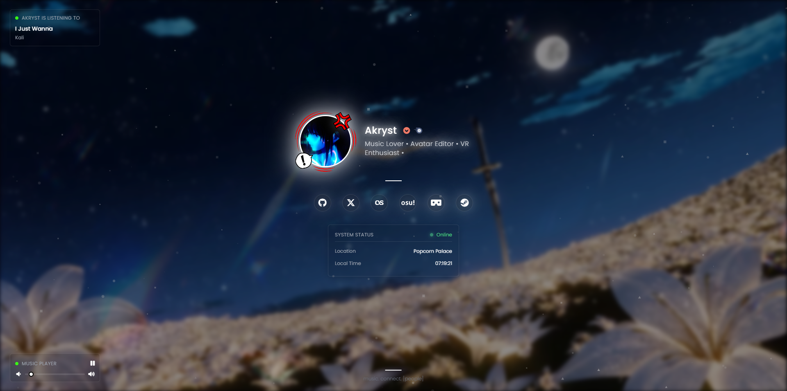

# Meow - Personal Bio Page

A customizable personal bio page with Discord integration, Last.fm, music player, and dynamic backgrounds.

<p align="center">
   <a href="https://bio.akryst.lol"><b>Live demo</b></a>
   &nbsp;·&nbsp;
   <a href="https://discord.gg/zZ9umH8Jja"><b>Discord</b></a>
</p>



## Setup

**1. Install dependencies**
```bash
npm install
```

**2. Run the server**
```bash
npm start
```

**3. Open the setup wizard**

Visit `http://localhost:3000/setup` and fill in your info — name, description, social links, Discord, Last.fm, profile image, and background.

The wizard saves everything and locks itself after the first run. To reconfigure, delete `.setup-complete` and restart.

**4. Done**

Your page is live at `http://localhost:3000`.

---

> **Migrating from a previous version?** Rename `.env.example` to `.env`, fill it in manually, then run `npm run config` to generate `public/js/config.js` without going through the wizard.

## Commands

| Command | Description |
|---|---|
| `npm start` | Start the server |
| `npm run config` | Regenerate `config.js` from `.env` |
| `npm run release` | Create a release `.zip` (uses `git archive`) |
| `npm run serve` | Serve static files only |

## License

Open source — use freely. Made with ❤️ by Akryst
